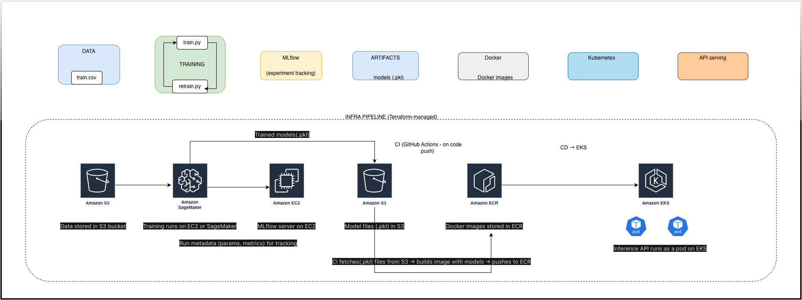

# MLOps Pipeline — Training to Kubernetes Serving

An end-to-end machine learning pipeline that takes data through training, experiment tracking, containerization, and deployment to Kubernetes. Built to demonstrate production-ready MLOps practices.



---

## What Is This Project?

This project builds an MLOps pipeline from data to API serving: training with MLflow, model artifacts in S3, Docker images in ECR, and inference API on Kubernetes (EKS). The infrastructure is designed to be provisioned with Terraform. CI/CD (GitHub Actions) builds images on code push and deploys to EKS.

---

## What We've Built

| Component | Description |
|-----------|-------------|
| **Training** | Reproducible model training with MLflow tracking and model registry |
| **Artifacts** | Versioned model files and run metadata |
| **Inference API** | Flask API with `/predict`, `/metrics`, and `/reload` endpoints |
| **Docker** | Containerized inference service |
| **Kubernetes** | Deployment, Service, and ConfigMap for production-style serving |
| **Rollback** | Switch model versions via ConfigMap—no redeploy needed |

---

## Architecture

```
Data → Training → MLflow → Artifacts → Docker → Kubernetes → API Serving
```

- **Data:** `train.csv` (Boston Housing–style regression)
- **Training:** `train.py` and `retrain.py` (time-based retrain logic)
- **MLflow:** Experiment tracking and model registry
- **Artifacts:** `models/*.pkl` and `experiments/runs.json`
- **Docker:** Inference image (local or K8s-ready)
- **Kubernetes:** Deployment + Service + ConfigMap
- **API:** Version-aware predictions with optional rollback

---

## Tech Stack

- **Python 3.9+** — Training and inference
- **MLflow** — Experiment tracking and model registry
- **Flask** — Inference API
- **Docker** — Containerization
- **Kubernetes** — Orchestration (minikube for local; same manifests for cloud)
- **scikit-learn, pandas** — Model and data

---

## Getting Started

**Prerequisites:** Python 3.9+, Docker, minikube (for K8s), `kubectl`

**Clone and install:**
```bash
git clone https://github.com/TharakNarredla/mlops.git
cd mlops
pip install -r requirements.txt
```

**Train a model:**
```bash
python3 src/train.py
```

**Run inference locally:**
```bash
python3 -m src.serve.app
# API runs on http://127.0.0.1:8000
```

**Deploy to Kubernetes (minikube):**
```bash
eval $(minikube docker-env)
docker build -f Dockerfile.inference.k8s -t mlops-inference:latest .
kubectl apply -f k8s/
kubectl port-forward svc/mlops-inference 8000:8000
```

**Optional — MLflow UI:**
```bash
python3 -m mlflow server --backend-store-uri sqlite:///mlflow.db --default-artifact-root ./mlruns --host 0.0.0.0 --port 5001
# Open http://127.0.0.1:5001
```

---

## Project Structure

```
├── data/           # Training data (train.csv)
├── src/
│   ├── train.py    # Training with MLflow logging
│   ├── retrain.py  # Retrain decision logic
│   └── serve/      # Flask inference API
├── k8s/            # Kubernetes manifests (Deployment, Service, ConfigMap)
├── terraform/      # AWS infra (S3, ECR, EKS) — see terraform/README.md
├── models/         # Model artifacts (generated by train.py)
├── experiments/    # Run metadata (runs.json)
└── docs/           # API docs, architecture diagram, phase guides
```

---

## Rollback

To serve a different model version without redeploying:

```bash
kubectl edit configmap mlops-inference-config
# Set MODEL_RUN_ID to the desired run_id (from experiments/runs.json)

kubectl rollout restart deployment/mlops-inference
```

---

## Documentation

- `docs/api.md` — API contract and endpoints
- `docs/ARCHITECTURE.md` — Pipeline overview
- `docs/MLFLOW.md` — MLflow usage
- `docs/DOCKER.md` — Docker setup
- `docs/KUBERNETES.md` — Kubernetes deployment

---

## License

MIT
